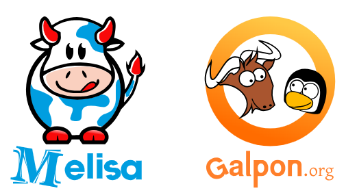

---
# try also 'default' to start simple
theme: seriph
# random image from a curated Unsplash collection by Anthony
# like them? see https://unsplash.com/collections/94734566/slidev
background: https://cover.sli.dev
# some information about your slides (markdown enabled)
title: esLibre 2026
info: |
  ## Scala 2.13.x -> Scala 3.3.6
class: text-center
# https://sli.dev/features/drawing
drawings:
  persist: false
# slide transition: https://sli.dev/guide/animations.html#slide-transitions
transition: slide-left
# enable Comark Syntax: https://comark.dev/syntax/markdown
comark: true
# duration of the presentation
duration: 15min

---
# Scala 2.13.x -> Scala 3.3.6

una historia de la migración

<footer class="absolute bottom-0 left-0 right-0 p-4 text-center text-sm text-gray-400 opacity-75">
    esLibre 2026, Melide, April 17-18, 2026
    <br>
    Dawid Furman 
</footer>

<!--
FOR ME NOTES
-->

---
layout: center
class: text-center
---

# CCEO "...yo ya me pierdo en este mundo moderno..."

<div v-click class="mt-10 mx-auto max-w-2xl p-6 bg-black text-green-400 font-mono rounded-xl shadow-2xl border-2 border-green-900 text-left">
  <div class="flex gap-2 mb-4 border-b border-green-900 pb-2">
    <div class="w-3 h-3 rounded-full bg-red-500"></div>
    <div class="w-3 h-3 rounded-full bg-yellow-500"></div>
    <div class="w-3 h-3 rounded-full bg-green-500"></div>
    <span class="text-xs ml-2 opacity-50 text-white">top_secret_prompt.sh</span>
  </div>

  <div grid="~ cols-1 gap-2">
    <div><span class="text-white">Contexto:</span> "Scala 2.13.x to Scala 3.3.6 migración."</div>
    <div><span class="text-white">Contenido:</span> Comparando la rama <span class="text-red-400">legacy/2.13</span> con <span class="text-blue-400">feature/scala3</span></div>
    <div><span class="text-white">Objetivo:</span> "Generar un reporte técnico de cambios críticos post-migración orientados a desarrolladores"</div>
    <div><span class="text-white">Ejecución:</span>Genera en un formato markdown, un reporte conciso con ejemplos de código y una sencilla explicación de cada cambio. Categoriza los cambios en funciona de novedades de Scala 3.</div>
  </div>
</div>

<!-- 
NARRATIVA DIVERTIDA:
Aquí el chiste es que la IA no es una varita mágica, 
es un becario muy rápido al que hay que darle órdenes claras (CCOE).
Relaja a la gente admitiendo que a veces te sientes superado, 
pero que con el "prompt" adecuado, hasta Scala 3 parece fácil.
-->


---
layout: center
---

# Érase una vez...
### ...una base de código en <span v-mark.underline.orange>Scala 2.13.x</span>
<div v-click>y un equipo ambicioso que quería<span v-mark.underline.orange> dar el salto</span>
</div>

<div v-click class="mt-10 opacity-80 italic">
  "De cómo nuestro equipo decidió saltar al vacío (y convenció a Negocio para que pusiera la red)"
</div>

<!-- 
NARRATIVE HOOK:

-->

---
layout: center
---

# 🎒 Un viaje de mil millas comienza con un solo paso
### El Stack Tecnológico (Scala 2.13.x)

<div grid="~ cols-2 gap-10" class="mt-10 text-left">

  <div v-click v-mark.bracket.left.orange>
    <h3 class="mb-4 text-orange-400">El Núcleo</h3>
    <ul class="space-y-4 text-left">
      <li><span class="opacity-50 text-sm italic text-left">Lenguaje:</span> <br> <b class="text-left">Scala 2.13.x</b></li>
      <li><span class="opacity-50 text-sm italic text-left">Build Tool:</span> <br> <b class="text-left">SBT</b></li>
      <li><span class="opacity-50 text-sm italic text-left">Arquitectura:</span> <br> <b class="text-left">Microservicios</b></li>
      <li><span class="opacity-50 text-sm italic text-left">Infra/Entrega</span> <br> <b class="text-left">CaaS</b></li>
    </ul>
  </div>

  <div v-click v-mark.bracket.right.yellow>
    <h3 class="mb-2 text-blue-400">Librerías App</h3>
    <div class="grid grid-cols-2 gap-2 text-xs font-mono mb-4">
      <div class="p-2 border border-blue-500/30 rounded bg-blue-500/5">cats-core</div>
      <div class="p-2 border border-blue-500/30 rounded bg-blue-500/5">cats-effect</div>
      <div class="p-2 border border-blue-500/30 rounded bg-blue-500/5">fs2 / kafka</div>
      <div class="p-2 border border-blue-500/30 rounded bg-blue-500/5">http4s</div>
      <div class="p-2 border border-blue-500/30 rounded bg-blue-500/5">smithy4s</div>
      <div class="p-2 border border-blue-500/30 rounded bg-blue-500/5">pureconfig-core</div>
      <div class="p-2 border border-blue-500/30 rounded bg-blue-500/5">circe-core</div>
      <div class="p-2 border border-blue-500/30 rounded bg-blue-500/5">redis4cats-effects</div>
      <div class="p-2 border border-blue-500/30 rounded bg-blue-500/5">doobie-core</div>
      <div class="p-2 border border-blue-500/30 rounded bg-blue-500/5">slick</div>
    </div>
    <h3 class="mb-2 text-green-400">Librerías Test</h3>
    <div class="grid grid-cols-2 gap-2 text-xs font-mono">
      <div class="p-2 border border-green-500/30 rounded bg-green-500/5">cucumber-scala</div>
      <div class="p-2 border border-green-500/30 rounded bg-green-500/5">karate</div>
      <div class="col-span-2 p-2 border border-green-500/30 rounded bg-green-500/5">testcontainers-scala</div>      
    </div>
  </div>
</div>
<div v-after class="mt-08 text-center opacity-70 italic text-sm">
  Todo muy potente, pero con una complejidad cognitiva alta... <br>
</div>

---
layout: center
---

# ⚖️ Un acuerdo de la Migración
### De la negociación a la ejecución

<div grid="~ cols-2 gap-x-12 gap-y-8" class="mt-8 text-left text-sm">
  <div v-click>
    <h3 class="text-orange-400 font-bold mb-2 text-left">🎯 El Objetivo: LTS</h3>
    <p class="text-xs text-left">Adoptar <b>Scala 3.3.6</b>. La estabilidad a largo plazo fue nuestra mejor moneda de cambio con negocio.</p>
  </div>

  <div v-click>
    <h3 class="text-blue-400 font-bold mb-2 text-left">🏗️ Estética Postergada</h3>
    <p class="text-xs text-left">Ignorar cambios de sintaxis (indentación). Usar <code>-rewrite</code> de forma automática y solo cuando sea necesario.</p>
  </div>

  <div v-click>
    <h3 class="text-green-400 font-bold mb-2 text-left">🛠️ Armamento Técnico</h3>
    <ul class="text-[11px] space-y-1 opacity-90 text-left">
      <li>• <b>sbt-scala3-migrate:</b> Nuestra brújula principal.</li>
      <li>• Flag <b>-future-migration</b> para ver el mañana, hoy.</li>
      <li>• Limpieza de plugins (Ej: <i>kind-projector</i> ya es nativo).</li>
    </ul>
  </div>

  <div v-click>
    <h3 class="text-purple-400 font-bold mb-2 text-left">🌉 Construyendo el Puente</h3>
    <p class="text-xs text-left">Uso estratégico de CrossVersion.for3Use2_13
    <code>
    ("com.github.t3hnar" %% "scala-bcrypt" % "4.3.0").cross(CrossVersion.for3Use2_13)
    </code> para mantener la paz con el ecosistema de librerías.</p>
  </div>
</div>

<div v-after class="mt-8 text-center text-xs opacity-50 italic text-left">
  "Primero que compile, luego que sea bonito."
</div>


---
layout: center
---

# 🏆 El Resultado: Dividir y Vencer
### Estrategia de migración por fases

<div grid="~ cols-2 gap-10" class="mt-10">
  <div v-click class="p-6 border-b-4 border-orange-400 bg-orange-400/5 rounded-t-xl text-left">
    <h2 class="text-orange-400 mb-4 text-left">Fase A: Básica</h2>
    <p class="text-sm text-left"><b>Migración minima.</b> <br> El objetivo es que compile y pase los tests. Cero cambios de sintaxis innecesarios para reducir el ruido en los MRs/PRs.</p>
  </div>

  <div v-click class="p-6 border-b-4 border-blue-400 bg-blue-400/5 rounded-t-xl text-left">
    <h2 class="text-blue-400 mb-4 text-left">Fase B: Idiomática</h2>
    <p class="text-sm text-left"><b>Modernización Real.</b> <br> Aquí es donde entra la diversión: <code>given/using</code>, <code>enums</code> y nueva sintaxis. Refactorización para "pensar en Scala 3" y utilzar todas sus novedades</p>
  </div>
</div>


---
layout: center
---

# 🛠️ sbt-scala3-migrate
### El flujo de trabajo en 4 comandos SBT (gracias a sbt-scala3-migrate)


Añade esta línea en tu archivo project/plugins.sbt:

 
```scala
addSbtPlugin("ch.epfl.scala" % "sbt-scala3-migrate" % "0.7.5")
```


<div class="mt-8 grid grid-cols-2 gap-4 text-xs font-mono text-left">
  <div v-click class="p-3 border border-orange-400/30 rounded bg-orange-400/5">1. migrateDependencies project</div>
  <div v-click class="p-3 border border-blue-400/30 rounded bg-blue-400/5 text-left">2. migrateScalacOptions project</div>
  <div v-click class="p-3 border border-green-400/30 rounded bg-green-400/5 text-left">3. migrateSyntax project</div>
  <div v-click class="p-3 border border-purple-400/30 rounded bg-purple-400/5 text-left">4. migrateTypes project</div>
</div>


---
layout: center
---

# Destacar temas tecnicos de la migración
 ¡Ahora sí, ya podemos hablar un poco de lo que hemos vivido durante esta aventura!

---

# Implicits ➔ Contextual Abstractions
### El concepto lo más sobrecargado en Scala 2.x

```
trait Formatter[T] { // Type Class
  def format(value: T): String
}
```

* Contexto ``` def printFormatted[T](value: T)(implicit formatter: Formatter[T])```
* Instancias de Type Class ```implicit val intFormatter: Formatter[Int] = ??? ``` 
* Extensions methods ```implicit class FormatterOps[T](value: T) { ```
* Conversion de tipos automatica 
``` 
import scala.language.implicitConversions
implicit def intToString(i: Int): String = i.toString
```

* implicitamente obtener uan instancia del contexto ```val formatter = implicitly[Formatter[T]] ```


---

# Implicits ➔ Contextual Abstractions
### Scala 3.x

```
trait Formatter[T] { // Type Class
  def format(value: T): String
}
```

* Contexto 
``` 
def printFormatted[T](value: T)(using formatter: Formatter[T]): Unit = {
  println(formatter.format(value))
}
```

* Instancias de Type Class  ``` given Formatter[Int] = (value: Int) => s"Número: $value" ``` 


---

# Implicits ➔ Contextual Abstractions
### Scala 3.x

```
trait Formatter[T] { // Type Class
  def format(value: T): String
}
```

* Extensions methods 

``` extension [T](value: T)(using formatter: Formatter[T]) def formatted: String = formatter.format(value) ```

* Conversion de tipos automatica  
``` given Conversion[Int, String] with def apply(i: Int): String = i.toString ```

implicitamente obtener una instancia del contexto ```val formatter = summon[Formatter[T]] ```

---

# Implicits ➔ Contextual Abstractions
### ¡Notas!

=>> los `given` deben importarse explicitamente ```import com.your.domain.given```

=>> scalacOptions `"3.3-migration"`  - un ayudante para normalizar la migración

---

# Macros & Metaprogramming
### Un paso por una montaña muy picosa

<div class="space-y-4">
  <div v-click class="p-4 border-l-4 border-red-500 bg-red-500/5">
    <h4 class="font-bold">Incompatibilidad Total</h4>
    <p class="text-sm">Las macros de Scala 2 (basadas en reflexión del compilador) no funcionan en Scala 3 (basadas en TASTY Typed Abstract Syntax Trees).</p>
  </div>

  <div v-click class="p-4 border-l-4 border-orange-500 bg-orange-500/5">
    <h4 class="font-bold">Estrategia de Supervivencia</h4>
    <ul class="text-xs space-y-2">
      <li>Flag: <code>-Xignore-scala2-macros</code> para poder seguir compilando - CUIDADO es exclusivamente para migración</li>
      <li>Dependencia en librerías que ya han migrado su derivación (Circe, Smithy4s).</li>
      <li>El compilador de Scala 3 es mucho más capaz de derivar tipos sin macros personalizadas.</li>
    </ul>
  </div>
</div>


---

# Macros & Metaprogramming
### "Un paseo" por una montaña muy picosa

<div grid="~ cols-2 gap-10" class="mt-8">

<div class="space-y-4">
  <div v-click class="flex gap-4 items-start p-4 bg-red-400/10 border-l-4 border-red-500 rounded-r-lg">
    <div class="i-carbon-warning text-2xl text-red-500 flex-none mt-1" />
    <div class="text-left">
      <h4 class="font-bold text-red-400">El Problema: TASTY</h4>
      <p class="text-xs mt-1">Metadata pesada del compilador que viaja en el JAR por defecto.</p>
    </div>
  </div>

  <div v-click class="flex gap-4 items-start p-4 bg-orange-400/10 border-l-4 border-orange-500 rounded-r-lg">
    <div class="i-carbon-cloud-ceiling text-2xl text-orange-500 flex-none mt-1" />
    <div class="text-left">
      <h4 class="font-bold text-orange-400">Impacto en CI/CD</h4>
      <p class="text-xs mt-1">El JAR creció en <b>400MB</b>, quemando la cuota de JFrog.</p>
    </div>
  </div>
</div>

<div v-click class="space-y-4">
  <div class="p-4 bg-green-400/10 border-l-4 border-green-500 rounded-r-lg">
    <div class="flex items-center gap-2 mb-2">
      <div class="i-carbon-checkmark-filled text-xl text-green-500" />
      <h4 class="font-bold text-green-400">Solución: MergeStrategy.discard</h4>
    </div>
    <p class="text-[10px] mb-4 text-left">Eliminar los archivos <code>.tasty</code> durante el assembly si no se necesitan en runtime.</p>
    
```scala {all}
...
assembly / assemblyMergeStrategy := {
  case PathList(ps @ _*) 
    if ps.last.endsWith(".tasty") => 
      MergeStrategy.discard
...
}
```
    </div>
  </div>
</div>


---

# Data Modeling: Opaque Types & Enums/ADTs
### Seguridad sin boxing al cruzar fronteras genéricas

<div grid="~ cols-2 gap-10" class="mt-4">

<div class="p-6 border-l-4 border-red-500 bg-red-400/5 rounded-r-xl text-left">
  <div class="flex items-center gap-2 mb-4">
    <div class="i-carbon-cube text-2xl text-red-500" />
    <h3 class="text-red-400 font-bold text-sm">Opaque Types</h3>
  </div>
  
```scala {all}
opaque type MsgUID = String

object MsgUID:
  def apply(s: String): MsgUID = s
```
<p class="text-[9px] mt-2 opacity-60 italic text-right">Cero huella en memoria, 100% tipado.</p>
</div>

<div class="p-6 border-l-4 border-green-500 bg-green-400/5 rounded-r-xl text-left">
  <div class="flex items-center gap-2 mb-4">
    <div class="i-carbon-tree-view text-2xl text-green-500" />
    <h3 class="text-green-400 font-bold text-sm">Native Enums</h3>
  </div>
  
```scala {all}
enum DomainError(val errorCode: String, val errorMessage: String) extends NoStackTrace:
  case UnknownError(msg: String)   extends DomainError("E000", msg)
  case InvalidDomainCode           extends DomainError("E001", "Invalid Code")
```
<p class="text-[9px] mt-2 opacity-60 italic text-right">Sustitución real de sealed abstract class.</p>
</div>

</div>

<div v-click class="mt-4 p-6 border-l-4 border-green-500 bg-green-400/5 rounded-r-xl text-left">

<div class="text-[11px]">

```scala {all}
val error = DomainError.UnknownError("Unknown error")
error match
  case DomainError.UnknownError(msg) => s"Handling unknown error: $msg"
  case DomainError.InvalidDomainCode => "Handling an invalid domain code."
```

</div>
</div>

---

# Term Matching vs Type Matching  
### La "Regla de Oro" en Scala 3

<div grid="~ cols-2 gap-4">
<div>

```scala
// Representación de eventos
case class Ping(id: String)
case object Pong
```

<ul class="text-xs mt-4 space-y-2">
  <li>• <b>Clases:</b> Usar <code>_: Ping</code> o <code>Ping(id)</code>.</li>
  <li>• <b>Objetos:</b> Emparejar directamente por valor.</li>
</ul>
</div>

<div class="bg-red-800 p-4 rounded text-xs font-mono">
  <div class="text-orange-400 opacity-50 mb-2">// El compilador te avisará:</div>
  
  msg match <br>
  &nbsp;&nbsp;case Pong => "Ok" <br>
  &nbsp;&nbsp;<span v-mark.underline.red>case Ping</span> => "Error en Scala 3" <br>
  &nbsp;&nbsp;<span v-mark.underline.green>case _: Ping </span> => "Ahora sí"
</div>
</div>

<div v-click class="mt-8 p-4 bg-green-500/10 rounded border border-green-400/20 text-xs">
  <b>Tip:</b> Si el tipo tiene parámetros (aunque sea <code>Ping()</code>), es una Clase. Para ignorar el contenido, usa <code>_:</code>.
</div>


---

# Higher-Kinded Types
### Los Tipos que reciben otros tipos

=>> `-language:higherKinds` - el plugin ya no es necesario

=>> Type Lambdas de primera clase : Nativo operador =>> 

=>> Bounds 
```scala {all}
type NL[N <: Number] =>> List[N]
```

=>> Trata Tipos como si fueran funciones


```scala {all}

import cats.data.{NonEmptyChain, Validated}
import cats.effect.IO
import cats.syntax.validated.*
import cats.Applicative

val validationApplicative = Applicative[IO].compose[[A] =>> Validated[NonEmptyChain[DomainError], A]]
```

---

# El Futuro de la Pipeline (CI/CD)
### Pequeños ajustes, gran impacto

<div class="space-y-4 mt-8">
  <div v-click class="flex gap-4 items-center p-4 bg-gray-500/5 rounded">
    <div class="i-carbon-flow-connection text-3xl text-blue-400" />
    <div class="text-sm">Actualización de plugin <b>scoverage</b> (v2.3+) para soporte nativo de Scala 3.</div>
  </div>
  
  <div v-click class="flex gap-4 items-center p-4 bg-gray-500/5 rounded">
    <div class="i-carbon-settings-adjust text-3xl text-green-400" />
    <div class="text-sm">Aislamiento de tareas de migración en la CI para evitar PRs infinitos.</div>
  </div>
  
  <div v-click class="flex gap-4 items-center p-4 bg-gray-500/5 rounded">
    <div class="i-carbon-cloud-satellite text-3xl text-orange-400" />
    <div class="text-sm">Nuevas <code>scalacOptions</code> específicas para avisos de migración y descarte de valores.</div>
  </div>
</div>

--- 

# Recursos 

https://docs.scala-lang.org/scala3/guides/migration/compatibility-intro.html

https://docs.scala-lang.org/scala3/guides/migration/scala3-migrate.html

https://docs.scala-lang.org/scala3/guides/tasty-overview.html

---

# Mi segunda vez en esLibre - un recuerdo, Vigo 2022


---
layout: center
class: text-center
---

# Gracias e Grazas
<center>
  
</center>

<PoweredBySlidev mt-10 />
